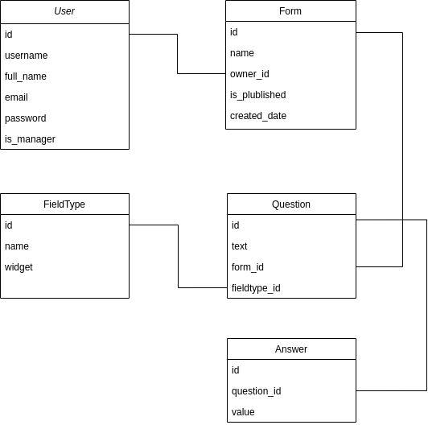

# Custom fields project

## Summary
This project will allow managers to generate dynamic forms for the different teams on the ground. It is a responsive web platform that stores the forms templates and the data uploaded with those forms.

## Scope
We will have different sections to different user types:

* **Auth**: The service is available to all our internal users using or SSO (single sing on) service.
* **Admin Forms**: A managers section for creating dynamic forms.
* **Forms**: A section to see the available forms and register new answers.

## Modeling
Our data model is described below:

We have a User resource allowed to create Forms and Questions, a FieldType resource to define the type of input that should be used for each Question and an Answer resource to store all anwers provided every time that a form is used.

A new form is available once all questions are defined and the form is finished. The form is available while it is marked as published.

Users (the team) can use the published forms to record new answers at any time.

## API
